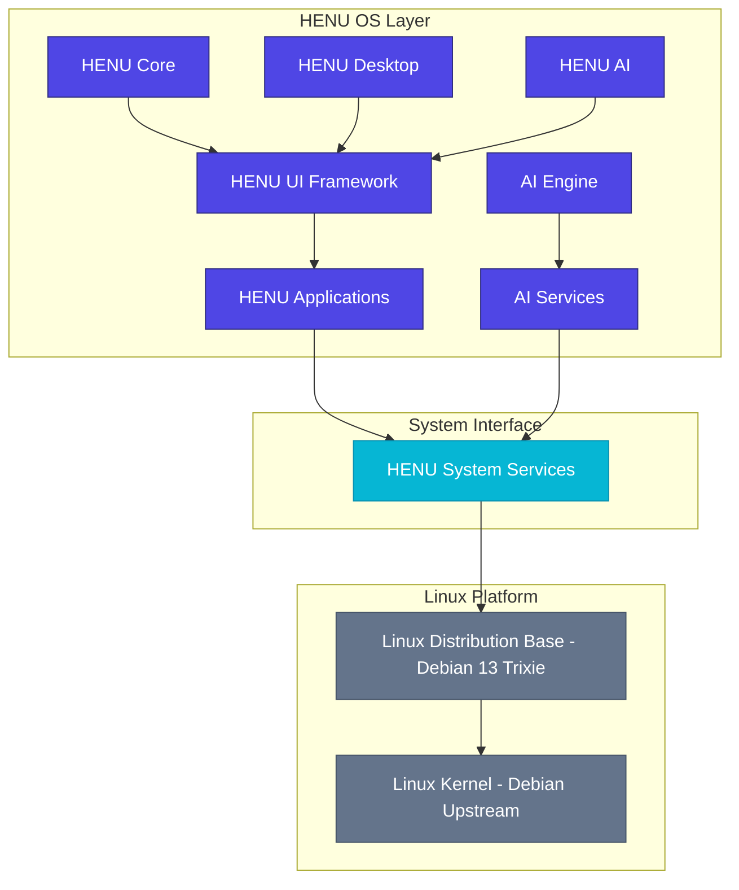

# HENU OS 3.0 Architecture Specification

This document details the software, build, package, AI, security, repository, and release architectures for **HENU OS 3.0** (specifically `3.0.0-alpha.1`).

---

## 1. System Layered Architecture

HENU OS 3.0 is built on a clean, layered architecture designed to isolate proprietary and value-add HENU layers from the underlying Linux base.



- **HENU Core, Desktop & AI**: Custom user experience and automation stacks.
- **HENU System Services**: The glue translation layer interfacing applications with local services.
- **Linux Distribution Base & Kernel**: Downstream Debian 13 (*Trixie*) base, kept unmodified to preserve upstream stability.

---

## 2. Build Pipeline Architecture

The build process is fully automated. Developers do not make manual changes to the live filesystem. Every customization is driven via configurations and scripts using Debian `live-build`:

```text
Debian 13 (Trixie) Base
       │
       ▼
[Build Configuration]  ──► (YAML configurations specifying packages & base)
       │
       ▼
[debootstrap Bootstrap]──► (Minimal Debian rootfs generation)
       │
       ▼
[APT Package Injection]──► (APT package group installations)
       │
       ▼
[Apply Branding]       ──► (Custom assets, themes, GRUB, Plymouth screens)
       │
       ▼
[Install HENU Packages]──► (Locally compiled .deb packages & drivers)
       │
       ▼
[Install HENU Apps]    ──► (apps/ compiled targets)
       │
       ▼
[Security Hardening]   ──► (AppArmor policies, firewall rules)
       │
       ▼
[live-build ISO Build] ──► (Generating hybrid live bootable ISO files)
       │
       ▼
[QEMU Boot Testing]    ──► (Automated QA verification suite)
       │
       ▼
[Release]              ──► (Distribution channels, manifests, checksums)
```

---

## 3. Package Stack Architecture

Packages are layered to ensure dependency clarity and keep HENU custom packages distinct from upstream packages:

1. **Base Packages**: Core CLI utilities, system tools, APT packaging.
2. **Desktop Packages**: Display managers (GDM3), GNOME shell, fonts, X11/Wayland servers.
3. **Developer Packages**: Compiler toolchains (`build-essential`, `dpkg-dev`), libraries, debuggers, SDK.
4. **Cyber Packages**: Network analyzers, penetration and validation testing tools (`nmap`, `tshark`, `ufw`).
5. **AI Packages**: Tensor libraries, runtime environments, offline neural networks.
6. **HENU Packages**: Custom user space services and software (`.deb` format).
7. **Themes & Branding**: Wallpapers, icon libraries, styling assets (`henu-branding.deb`).
8. **Drivers**: Hardware enablement patches and kernel modules.
9. **Utilities**: Automation helper tools.

---

## 4. AI Engine Architecture

HENU AI operates modularly, enabling hot-swaps of models and system prompt sets without redesigning the core system.

```text
               ┌───────────────────────┐
               │        HENU AI        │
               └───────────┬───────────┘
                           ▼
               ┌───────────────────────┐
               │        AI Core        │
               └───────────┬───────────┘
                           ▼
 ┌─────────────────┬───────┴───────┬─────────────────┐
 │ Model Manager   │ API Manager   │ Prompt Engine   │
 ├─────────────────┼───────────────┼─────────────────┤
 │ Memory          │ Voice Engine  │ Vision Engine   │
 ├─────────────────┼───────────────┼─────────────────┤
 │ Automation Eng. │ Developer Eng.│ Security Engine │
 └─────────────────┴───────────────┴─────────────────┘
```

---

## 5. Security & Hardening Architecture

Security is baked in by default and covers all system operations:

- **Security Core**: Basic cryptographic operations, credentials manager.
- **Firewall**: Default ingress-blocking configurations via UFW / nftables.
- **AppArmor Policies**: Mandatory Access Control (MAC) profiles tailored to HENU apps.
- **Disk Encryption**: Full disk LUKS encryption supported by the installer.
- **Secure Boot Support**: Custom key signing validation for UEFI bootloaders.
- **Permission Manager**: Fine-grained sandboxing permission broker for HENU apps.
- **Security Dashboard & Log Analyzer**: Real-time security events auditing and visual alerts.

---

## 6. Repository Responsibilities

Each of the following targets maps to a distinct Git repository inside the `github.com/henu-os` organization:

- `henu-os`: Master integration workspace and Debian build configuration base.
- `henu-branding`: System-wide custom themes, wallpapers, GDM3, GRUB styling.
- `henu-desktop`: Desktop environment configurations and panels.
- `henu-installer`: Modular Calamares / Debian-Installer configuration.
- `henu-ai`: AI engines and local model running environments.
- `henu-hub`: System portal and app-store package interface.
- `henu-assistant`: Desktop conversational companion app.
- `henu-cloud`: Sync integrations and backup system.
- `henu-ide`: Native software development application.
- `henu-firewall`: Graphic frontend for system firewall.
- `henu-update`: Transactional updates utility.
- `henu-settings`: Custom control panel application.
- `henu-terminal`: Advanced GPU-accelerated shell.
- `henu-sdk`: APIs and libraries for third-party developer integrations.
- `website`: Main promotional and hosting website source.
- `docs`: Developer manuals and architectural books.

---

## 7. Release Lifecycle

Different channels ensure broad validation coverage before packages reach end users:

```text
Development ──► Nightly ──► Alpha (3.0.0-alpha.1) ──► Beta ──► Release Candidate ──► Stable ──► LTS ──► Enterprise
```

---

## 8. What NOT to Change Policy

To preserve stability and ease upstream upgrades, **never rewrite or fork**:
- **The Linux kernel** (use base Debian `linux-image-amd64` packages unless resolving a hardware bug).
- **Core GNU utilities** (`coreutils`, `findutils`, etc.).
- **System compiler toolchain** (`gcc`, `clang`, `glibc`).
- **Fundamental graphics stack** (`Mesa`, `Wayland`, `Xorg`).
