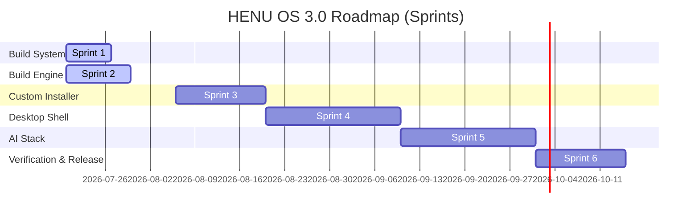

# HENU OS 3.0 Development Roadmap

This roadmap defines the phases and milestones for bringing **HENU OS 3.0** (based on Debian GNU/Linux 13 Trixie) from structural planning to enterprise release status.

---

## 📅 Milestones Summary

---

## 🏃 Sprint Breakdown

### 🟢 Sprint 1: Build System Foundation (Completed)
- **Goal**: Initialize local directories, repository definitions, branching guides, design standards, and document core architectures.
- **Key Deliverables**:
  - Root directory structure layout.
  - Development Guidelines & Release process documentation.
  - Sub-application skeleton repositories (`apps/*`).
  - Draft build pipeline configuration specifications (`configs/build_config.yaml`).

### 🟢 Sprint 2: HENU Build Engine & Debian 13 Migration (Completed)
- **Goal**: Build modular automation build engine orchestrator targeting Debian 13 (Trixie).
- **Key Deliverables**:
  - Re-designed configuration settings into split YAMLs (`debian`, `desktop`, `branding`, `package`, `kernel`, `installer`, `testing`, `security`, `release` configs).
  - Designed 20-stage `pipeline.py` interface workflow for Debian `live-build` and `debootstrap`.
  - Built custom logging module (`logging.py`) with split-log file channels.
  - Programmed verification checking routines in `validator.py` assessing Debian tools, space, and root permissions.
  - Added 13 application specifications under `docs/apps/`.

### 🟡 Sprint 3: Brand & Installer Customization
- **Goal**: Integrate branding modules and prepare custom install logic.
- **Key Deliverables**:
  - Calamares UI adjustments and custom install branding slides.
  - GRUB and Plymouth boot loader animations.
  - Core styling library, default font-family integrations, and high-definition icons.

### 🟡 Sprint 4: HENU Desktop Shell
- **Goal**: Develop the graphical user experience layer.
- **Key Deliverables**:
  - Default Desktop Environment (GNOME 47 extension config) setup.
  - Custom UI widgets layer using native graphics bindings.
  - Native file manager (`apps/files`) and terminal (`apps/terminal`) prototypes.

### 🟡 Sprint 5: AI Engine & Integrations
- **Goal**: Bring offline AI capability and agent features to life.
- **Key Deliverables**:
  - Local LLM execution context (ONNX / llama.cpp base integration).
  - System permission broker linking apps with the AI Core.
  - Conversational helper interface (`apps/assistant`).

### 🟡 Sprint 6: System Testing & Stable Releases
- **Goal**: Harden security features, perform compatibility sweeps, and launch release candidates.
- **Key Deliverables**:
  - Compliance checklist testing (AppArmor, firewall testing).
  - Nightly/Alpha/Beta channel pipelines configuration.
  - ISO installer verification on bare metal and virtual environments via QEMU.
